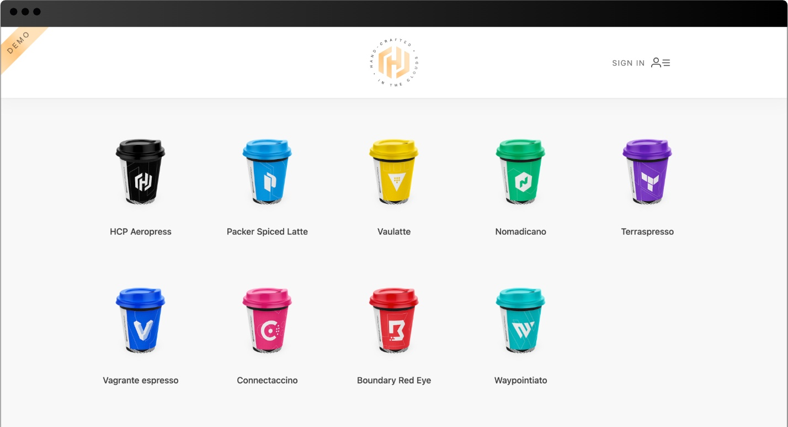
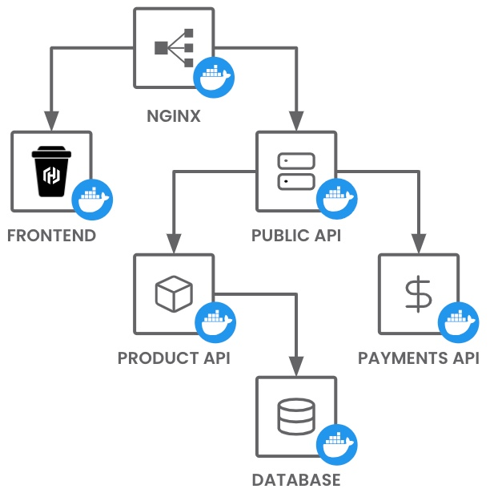
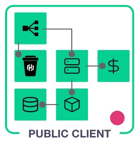
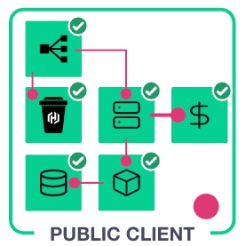
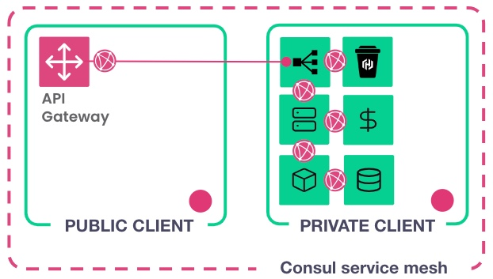
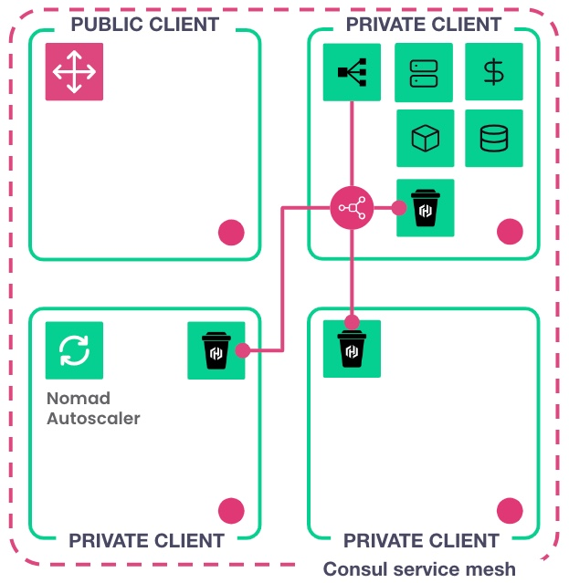

# Cracking the monolith with Consul and Nomad

This repo covers how to set up a cluster running both Consul and Nomad and use it to deploy the HashiCups application.

There are several jobspec files for the application and each one builds on the previous, moving away from the monolithic design and towards microservices.




## Prerequisites

- [Nomad CLI](https://developer.hashicorp.com/nomad/install) installed
- [Consul CLI](https://developer.hashicorp.com/consul/install) installed
- [Packer CLI](https://developer.hashicorp.com/packer/install) installed
- [Terraform CLI](https://developer.hashicorp.com/terraform/tutorials/aws-get-started/install-cli) installed
- [AWS account](https://portal.aws.amazon.com/billing/signup?nc2=h_ct&src=default&redirect_url=https%3A%2F%2Faws.amazon.com%2Fregistration-confirmation#/start) with [credentials environment variables set](https://docs.aws.amazon.com/cli/v1/userguide/cli-configure-envvars.html)
- [`openssl`](https://openssl-library.org/source/index.html) and [`hey`](https://github.com/rakyll/hey) CLI tools installed


## Steps

1. [Build the cluster](#1-build-the-cluster)
1. [Set up Consul and Nomad access](#2-set-up-consul-and-nomad-access)
1. [Deploy the initial HashiCups application](#3-deploy-initial-hashicups-application)
1. [Deploy HashiCups with Consul service discovery and DNS on a single VM](#4-deploy-hashicups-with-consul-service-discovery-on-a-single-vm)
1. [Deploy HashiCups with Consul service discovery and DNS on multiple VMs](#5-deploy-hashicups-with-consul-service-discovery-on-multiple-vms)
1. [Deploy HashiCups with service mesh and API gateway](#6-deploy-hashicups-with-service-mesh-and-api-gateway)
1. [Scale the HashiCups application](#7-scale-the-hashicups-application)
1. [Cleanup jobs and infrastructure](#8-cleanup)

## 1. Build the cluster

Begin by creating the machine image with Packer.

### Update the variables file for Packer

Change into the `aws` directory.

```
cd aws
```

Rename `variables.hcl.example` to `variables.hcl` and open it in your text editor.

```
cp variables.hcl.example variables.hcl
```

Update the region variable with your preferred AWS region. In this example, the region is `us-east-1`. The remaining variables are for Terraform and you can update them after building the AMI.

```yaml
# Packer variables (all are required)
region          = "us-east-1"

...
```

### Build the AMI

Initialize Packer to download the required plugins.

```
packer init image.pkr.hcl
```


Build the image and provide the variables file with the `-var-file` flag.

```
packer build -var-file=variables.hcl image.pkr.hcl
```

Example output from the above command.

```
Build 'amazon-ebs' finished after 14 minutes 32 seconds.

==> Wait completed after 14 minutes 32 seconds

==> Builds finished. The artifacts of successful builds are:
--> amazon-ebs: AMIs were created:
us-east-1: ami-0445eeea5e1406960
```

### Update the variables file for Terraform

Open `variables.hcl` in your text editor and update the `ami` variable with the value output from the Packer build. In this example, the value is `ami-0445eeea5e1406960`.

```yaml
# Packer variables (all are required)
region                    = "us-east-1"

# Terraform variables (all are required)
ami                       = "ami-0b2d23848882ae42d"
```

### Setup Consul server name

The Terraform code uses the Consul Terraform provider to create Consul ACL tokens.

Consul is configured with TLS encryption and to trust the certificate provided by the Consul servers. The Consul Terraform provider requires the `CONSUL_TLS_SERVER_NAME` environment variable to be set.

The Terraform code defaults the `datacenter` and `domain` variables in `variables.hcl` to `dc1` and `global` so `CONSUL_TLS_SERVER_NAME` will be `consul.dc1.global`.

You can update these variables with other values. If you do, be sure to also update the `CONSUL_TLS_SERVER_NAME` variable.


Export the `CONSUL_TLS_SERVER_NAME` environment variable.

```
export CONSUL_TLS_SERVER_NAME="consul.dc1.global"
```

### Deploy the datacenter

Initialize the Terraform configuration to download the necessary providers and modules.

```
terraform init
```

Provision the resources and provide the variables file with the `-var-file` flag. Respond `yes` to the prompt to confirm the operation.

```
terraform apply -var-file=variables.hcl
```

From the Terraform output you can retrieve the links to connect to your newly created datacenter.

```
Apply complete! Resources: 85 added, 0 changed, 0 destroyed.

Outputs:

Configure-local-environment = "source ./datacenter.env"
Consul_UI = "https://52.202.91.53:8443"
Consul_UI_token = <sensitive>
Nomad_UI = "https://52.202.91.53:4646"
Nomad_UI_token = <sensitive>
```

## 2. Set up Consul and Nomad access

Once Terraform finishes creating the infrastructure, you can set up access to Consul and Nomad from your local environment.

Run the `datacenter.env` script to set Consul and Nomad environment variables with values from the infrastructure Terraform created.

```
source ./datacenter.env
```

Open the Consul UI with the URL in the `Consul_UI` Terraform output variable and log in with the token in the `Consul_UI_token` output variable. You will need to trust the certificate in your browser.

Open the Nomad UI and log in with the [`ui -autheticate` command](https://developer.hashicorp.com/nomad/docs/commands/ui#authenticate). You can alternatively open the Nomad UI with the IP in `Nomad_UI` and log in with `Nomad_UI_token`.

```
nomad ui -authenticate
```

Test connectivity to the Nomad cluster from your local environment.

```
nomad server members
```

## 3. Deploy initial HashiCups application

HashiCups represents a monolithic application that has been broken apart into separate services and configured to run with Docker Compose. The initial version is a translation of the fictional Docker Compose file to a Nomad jobspec. The services and their relationships are shown in the diagram below.



This jobspec, named [`01.hashicups.nomad.hcl`](shared/jobs/01.hashicups.nomad.hcl), has the following attributes:
- All services run on the same VM (the Nomad public client node)
- Services are configured to use the Nomad client IP address or `localhost`
- No service health monitoring
- No scaling of services
- No secure connection (HTTPS)



Change to the `jobs` directory.

```
cd ../shared/jobs
```

Submit the job to Nomad.

```
nomad job run 01.hashicups.nomad.hcl
```

View the application by navigating to the public IP address of the NGINX service endpoint. This compound command finds the node on which the `hashicups` allocation is running (`nomad job allocs`) and uses the ID of the found node to retrieve the public IP address of the node (`nomad node status`). It then formats the output with the HTTP protocol.

```
nomad node status -verbose \
    $(nomad job allocs hashicups | grep -i running | awk '{print $2}') | \
    grep -i public-ipv4 | awk -F "=" '{print $2}' | xargs | \
    awk '{print "http://"$1}'
```

Example output from the above command.

```
http://18.191.53.222
```

Copy the IP address and open it in your browser. You do not need to specify a port as NGINX is running on port `80`.

Stop the deployment when you are ready to move on. The [`-purge` flag](https://developer.hashicorp.com/nomad/docs/commands/job/stop#purge) removes the job from the UI.

```
nomad job stop -purge hashicups
```

## 4. Deploy HashiCups with Consul service discovery on a single VM

This jobspec, named [`02.hashicups.nomad.hcl`](shared/jobs/02.hashicups.nomad.hcl), integrates Consul and has the following attributes:
- All services run on the same VM (the Nomad public client node)
- Services are registered in Consul
- Health checks have been implemented
- Services use Consul DNS (`<service>.service.<datacenter>.<domain>`)
- No scaling of services
- No secure connection (HTTPS)



Submit the job to Nomad.

```
nomad job run 02.hashicups.nomad.hcl
```

Open the Consul UI and navigate to the **Services** page to see that each microservice is now registered in Consul with health checks.

Click on the **nginx** service and then click on the instance name to view the instance details page. Copy the public hostname in the top right corner of the page and open it in your browser to see the application.

Stop the deployment when you are ready to move on.

```
nomad job stop -purge hashicups
```

## 5. Deploy HashiCups with Consul service discovery on multiple VMs

This jobspec, named [`03.hashicups.nomad.hcl`](shared/jobs/03.hashicups.nomad.hcl), has the following attributes:
- Job has been split into multiple groups with each one containing one application service
- Services are configured with `constraints` to now run on either the public Nomad node (Nginx) or private nodes (all other services)
- Services use Consul DNS (`<service>.service.<datacenter>.<domain>`)
- No scaling of services
- No secure connection (HTTPS)


Submit the job to Nomad.

```
nomad job run 03.hashicups.nomad.hcl
```

Open the Consul UI and navigate to the **Services** page to see that each microservice is now registered in Consul with health checks.

Click on the **nginx** service and then click on the instance name to view the instance details page. Copy the public hostname in the top right corner of the page and open it in your browser to see the application.

Open the Nomad UI and navigate to the **Topology** page from the left navigation to see that the NGINX service is running on a different node than the other services.

Stop the deployment when you are ready to move on.

```
nomad job stop -purge hashicups
```

## 6. Deploy HashiCups with service mesh and API gateway

This jobspec, named [`04.hashicups.nomad.hcl`](shared/jobs/04.hashicups.nomad.hcl), has the following attributes:
- All services now run on Nomad private client nodes
- Consul service mesh integration with upstream service configurations
- An API gateway has been added and runs on the Nomad public client node
- Nomad Workload Identity is used to automatically generate ACL tokens for the API gateway
- Consul service intentions have been added
- Secure connections with custom TLS certificates and mTLS with Envoy proxy (services now use `localhost`)

Additional configurations for the API gateway and service intentions exist in the `shared/jobs` directory and include [`04.api-gateway.config.sh`](shared/jobs/04.api-gateway.config.sh), [`04.api-gateway.nomad.hcl`](shared/jobs/04.api-gateway.nomad.hcl), and [`04.intentions.consul.sh`](shared/jobs/04.intentions.consul.sh).



Set up the API gateway configurations in Consul.

```
./04.api-gateway.config.sh
```

Set up the service intentions in Consul to allow the necessary services to communicate with each other.

```
./04.intentions.consul.sh
```

Submit the API gateway job to Nomad.

```
nomad job run 04.api-gateway.nomad.hcl
```

Submit the HashiCups job to Nomad.

```
nomad job run 04.hashicups.nomad.hcl
```

Open the Consul UI and navigate to the **Services** page to see that each microservice and the API gateway service are registered in Consul.

View the application by navigating to the public IP address of the API gateway. Note the `--namespace` flag; the API gateway is running in another namespace. You will need to trust the certificate in your browser.

```
nomad node status -verbose \
    $(nomad job allocs --namespace=ingress api-gateway | grep -i running | awk '{print $2}') | \
    grep -i public-ipv4 | awk -F "=" '{print $2}' | xargs | \
    awk '{print "https://"$1":8443"}'
```

Example output from the above command.

```
https://3.135.190.255:8443
```

Stop the deployment when you are ready to move on.

```
nomad job stop -purge hashicups
```

## 7. Scale the HashiCups application

This jobspec, named [`05.hashicups.nomad.hcl`](shared/jobs/05.hashicups.nomad.hcl), is the same as the previous one with the API gateway and service mesh but also has the following attribute:
- The frontend service contains a `scaling` block to allow the Nomad Autoscaler to automatically scale the service based on traffic load

Additional configurations for the Nomad Autoscaler exist in the `shared/jobs` directory and include [`05.autoscaler.config.sh`](shared/jobs/05.autoscaler.config.sh) and [`05.autoscaler.nomad.hcl`](shared/jobs/05.autoscaler.nomad.hcl).



The Nomad Autoscaler is a separate service and is run here as a Nomad job.

### Set up the Nomad Autoscaler and submit the jobs

Run the autoscaler configuration script.

```
./05.autoscaler.config.sh 
```

Submit the autoscaler job to Nomad.

```
nomad job run 05.autoscaler.nomad.hcl
```

Submit the HashiCups job to Nomad.

```
nomad job run 05.hashicups.nomad.hcl
```

### View the HashiCups application

View the application by navigating to the public IP address of the API gateway. Note the `--namespace` flag; the API gateway is running in another namespace. You will need to trust the certificate in your browser.

```
nomad node status -verbose \
    $(nomad job allocs --namespace=ingress api-gateway | grep -i running | awk '{print $2}') | \
    grep -i public-ipv4 | awk -F "=" '{print $2}' | xargs | \
    awk '{print "https://"$1":8443"}'
```

Example output from the above command.

```
https://3.135.190.255:8443
```

### Scale the frontend service

Get the public address of the API gateway again and export it as the environment variable `API_GW`.

```
$(nomad job allocs --namespace=ingress api-gateway | grep -i running | awk '{print $2}') | \
    grep -i public-ipv4 | awk -F "=" '{print $2}' | xargs | \
    awk '{print "https://"$1":8443"}' | export API_GW=$(cat)
```

In another browser tab, open the Nomad UI, click on the **hashicups** job name, and then click on the **frontend** task from within the **Task Groups** list. This page will display a graph that shows scaling events at the bottom of the page. Keep this page open so you can reference it when scaling starts.

Run the load test script and observe the graph on the frontend task page in the Nomad UI. Note that additional allocations are created as the autoscaler scales the frontend service up and then removed as the autoscaler scales it back down.

```
./05.load-test.sh $API_GW
```

Open up the terminal session from where you submitted the jobs and stop the deployment when you are ready to move on.

```
nomad job stop -purge hashicups
```

## 8. Cleanup

### Clean up jobs

Stop and purge the hashicups and autoscaler jobs.

```
nomad job stop -purge hashicups autoscaler
```

Stop and purge the api-gateway job. Note that it runs in a different namespace.

```
nomad job stop -purge --namespace ingress api-gateway
```

### Destroy infrastructure

Change to the `aws` directory.

```
cd ../../aws
```

Run the script to unset local environment variables.

```
source ../shared/scripts/unset_env_variables.sh
```

Use `terraform destroy` to remove the provisioned infrastructure. Respond `yes` to the prompt to confirm removal.

```
terraform destroy -var-file=variables.hcl
```

### Delete AMI and S3-store snapshots (optional)

Delete the stored AMI built using packer using the `deregister-image` command. 

```
aws ec2 deregister-image --image-id ami-0445eeea5e1406960
```

To delete stored snapshots, first query for the snapshot using the `describe-snapshots` command.

```
aws ec2 describe-snapshots \
    --owner-ids self \
    --query "Snapshots[*].{ID:SnapshotId,Time:StartTime}"
```

Next, delete the stored snapshot using the `delete-snapshot` command by specifying the `snapshot-id` value.

```
aws ec2 delete-snapshot --snapshot-id snap-1234567890abcdef0
```

## Reference

### HashiCups jobspec files and attributes

#### [01.hashicups.nomad.hcl](shared/jobs/01.hashicups.nomad.hcl)
- Initial jobspec for HashiCups
- Translation of fictional Docker Compose file to Nomad jobspec

#### [02.hashicups.nomad.hcl](shared/jobs/02.hashicups.nomad.hcl)
- Adds [`service` blocks](https://developer.hashicorp.com/nomad/docs/job-specification/service) with `provider="consul"` and [health checks](https://developer.hashicorp.com/nomad/docs/job-specification/check)
- Uses Consul DNS and static ports

#### [03.hashicups.nomad.hcl](shared/jobs/03.hashicups.nomad.hcl)
- Separates tasks into different groups
- Uses [client node constraints](https://developer.hashicorp.com/nomad/docs/job-specification/constraint)

#### [04.hashicups.nomad.hcl](shared/jobs/04.hashicups.nomad.hcl)
- Uses Consul service mesh
- Defines [service upstreams](https://developer.hashicorp.com/nomad/docs/job-specification/upstreams) and mapped service ports
- Uses `localhost` and [Envoy proxy](https://developer.hashicorp.com/consul/docs/connect/proxies/envoy) instead of DNS for service communication

#### [05.hashicups.nomad.hcl](shared/jobs/05.hashicups.nomad.hcl)
- Adds `scaling` block to the frontend service for [horizontal application autoscaling](https://developer.hashicorp.com/nomad/tools/autoscaling#horizontal-application-autoscaling)

### Other jobspec files

#### [04.api-gateway.nomad.hcl](shared/jobs/04.api-gateway.nomad.hcl)
- Runs the [API gateway](https://developer.hashicorp.com/consul/docs/connect/gateways/api-gateway) on port `8443`
- Constrains the job to a public client node

#### [05.autoscaler.nomad.hcl](shared/jobs/05.autoscaler.nomad.hcl)
- Runs the [Nomad Autoscaler agent](https://developer.hashicorp.com/nomad/tools/autoscaling/agent)
- Uses the [Nomad APM plugin](https://developer.hashicorp.com/nomad/tools/autoscaling/plugins/apm/nomad)